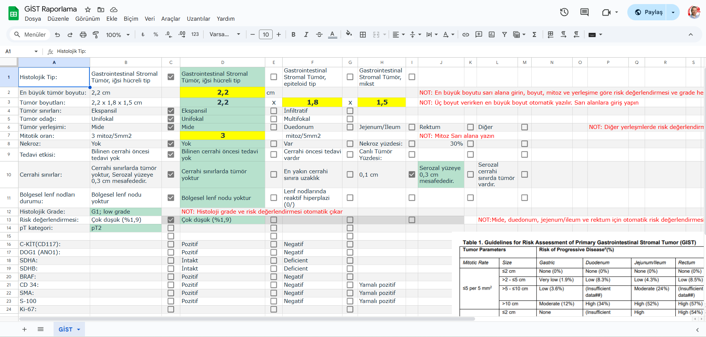

# GIST
CAP GİST Rapor Formatı

Bu depoda, **CAP GİST Protokolüne uyumlu rapor formatı** olarak hazırladığımız Excel dosyası yer almaktadır. Raporlama sürecinizi kolaylaştırmak, gerekli bilgilerin girilmesi ve otomatik olarak risk değerlendirme sonuçlarının üretilmesi amacıyla oluşturulmuştur.

## Özellikler

- **Kullanım Kolaylığı:** Gerekli bilgileri girin veya mevcut seçeneklere tıklayın.
- **Otomatik Rapor Oluşturma:** Girdiğiniz veriler doğrultusunda raporunuz otomatik olarak oluşturulur.
- **Risk Değerlendirme:** Yerleşime göre otomatik risk değerlendirme sonuçları (Mide, Duodenum, Jejenum/İleum, Rektum) sunar.
- **Çevrimiçi veya İndirilebilir:** Excel dosyasını kendi Drive’inize kopyalayarak online kullanım veya yerel olarak indirip kullanabilirsiniz.

## Dosyalar

- `GIST_Raporlama.xlsx`: CAP GİST protokolüne uygun olarak hazırlanmış Excel raporlama dosyası.
- `screen.png`: Rapor formatının ekran görüntüsü.

## Kullanım

1. **Dosyayı İndirin veya Kopyalayın:**  
   - Dosyayı yerel bilgisayarınıza indirerek kullanabilir veya Drive’inize kopyalayarak çevrimiçi düzenleyebilirsiniz.
2. **Gerekli Bilgileri Girin:**  
   - Excel dosyasında bulunan gerekli alanları doldurun veya mevcut seçenekleri kullanın.
3. **Otomatik Raporlama:**  
   - Girdiğiniz veriler doğrultusunda, raporunuz otomatik olarak oluşturulacaktır.

## Bağlantılar

- **CAP GİST Protokolü:**  
  [https://documents.cap.org/protocols/Stomach.GIST_4.3.0.0.REL_CAPCP.pdf](https://documents.cap.org/protocols/Stomach.GIST_4.3.0.0.REL_CAPCP.pdf)
- **Google Spreadsheet Rapor Formatı:**  
  [https://docs.google.com/spreadsheets/d/1bi4EVENYrw87fDdIVJ-_NUw7UoqcYm0KZnWMTPsPY-M/edit?gid=1415090610#gid=1415090610](https://docs.google.com/spreadsheets/d/1bi4EVENYrw87fDdIVJ-_NUw7UoqcYm0KZnWMTPsPY-M/edit?gid=1415090610#gid=1415090610)

## Katkıda Bulunanlar

Bu rapor formatı, raporlama sürecinizi kolaylaştırmak ve standartları yükseltmek amacıyla geliştirilmiştir. Her türlü öneri ve geri bildirim, projenin gelişimine katkıda bulunacaktır.
